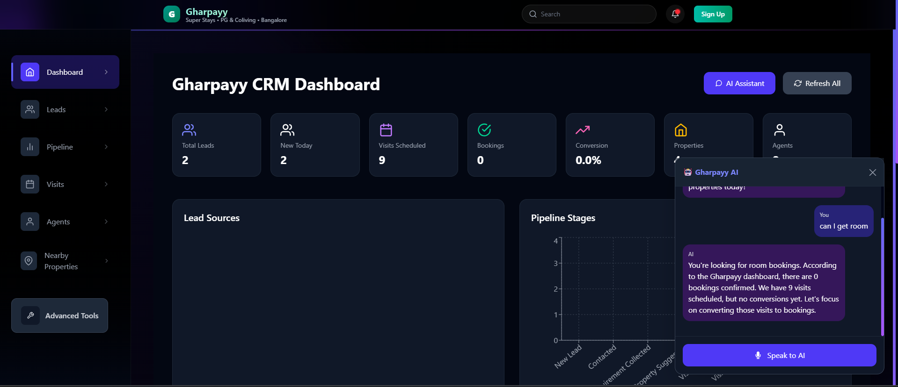
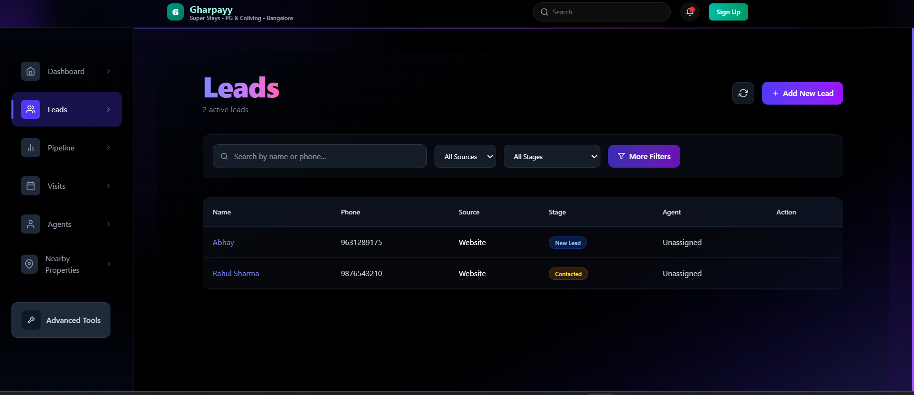
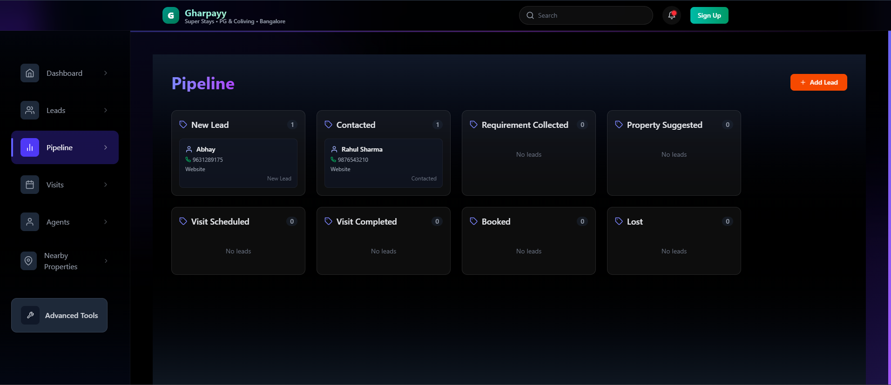
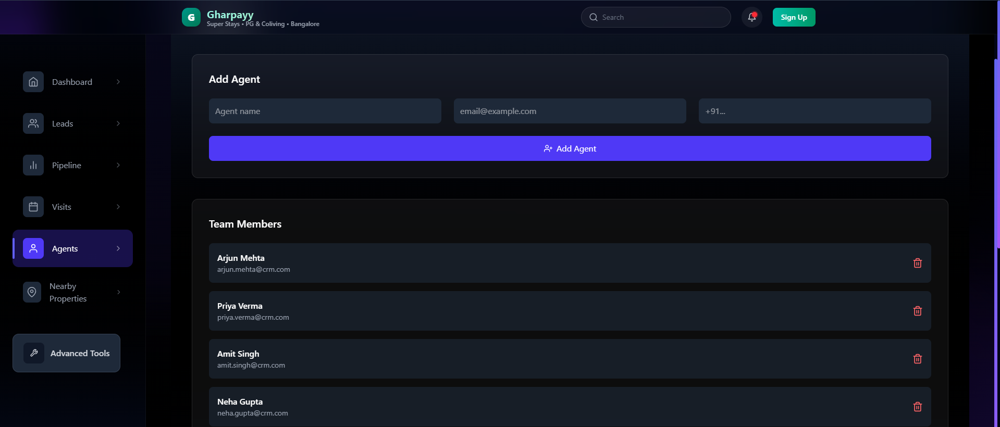
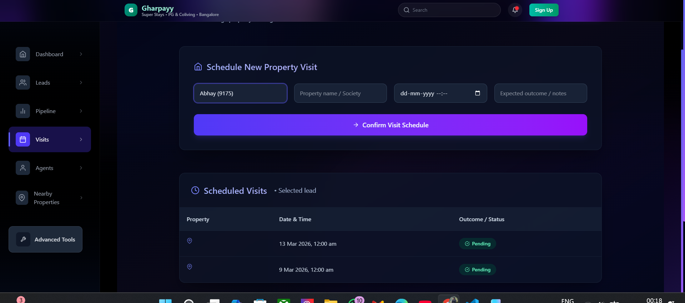
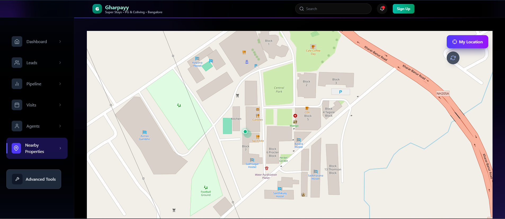

<div align="center">

# 🏠 GharPayy

### Modern CRM for Real Estate Teams

Manage **Leads • Properties • Agents • Visits • Analytics**  
in one powerful dashboard.

<br>

<a href="https://gharpayy-595d.vercel.app/">

</a>


</div>

---

# ✨ What Makes GharPayy Special

⚡ **Preview Mode** – Explore the dashboard without signup  
📊 **Real-time Analytics** – Conversion funnels & trends  
🏡 **Property Inventory** – Manage listings & owners  
👥 **Lead Pipeline** – Drag-and-drop sales stages  
🗺️ **Nearby Map** – Interactive property discovery  
📅 **Visit Scheduling** – Track upcoming visits  

---

# 🧠 Tech Stack

| Frontend | Backend | Database | Auth |
|--------|--------|--------|--------|
| React + Vite | Node.js + Express | PostgreSQL (Neon) | Clerk |

Libraries: **Tailwind • Framer Motion • Recharts • Leaflet**

---

# ⚡ Quick Start

```bash
git clone https://github.com/yourusername/gharpayy.git
cd gharpayy

Backend

cd backend
npm install
npm run dev

Frontend

cd frontend
npm install
npm run dev
🧭 Project Structure
gharpayy
 ├ backend
 │ ├ models
 │ ├ routes
 │ └ server.js
 │
 ├ frontend
 │ ├ components
 │ ├ pages
 │ └ App.jsx

```

---

# 📸 Screenshots

<div align="center">

### 📊 Dashboard


### 👥 Leads Management


### 🔁 Sales Pipeline


### 🏡 Agents


### 📅 Visits


### 🗺️ Property Map


</div>

---

🔮 Future Features

🤖 AI Lead Scoring
📲 WhatsApp Automation
👑 Role-Based Access
📊 Exportable Reports

<div align="center">
Built with ❤️ by

Abhay Kumar Yadav

B.Tech IT • Chandigarh Engineering College

⭐ Star this repo if you like the project

</div>
